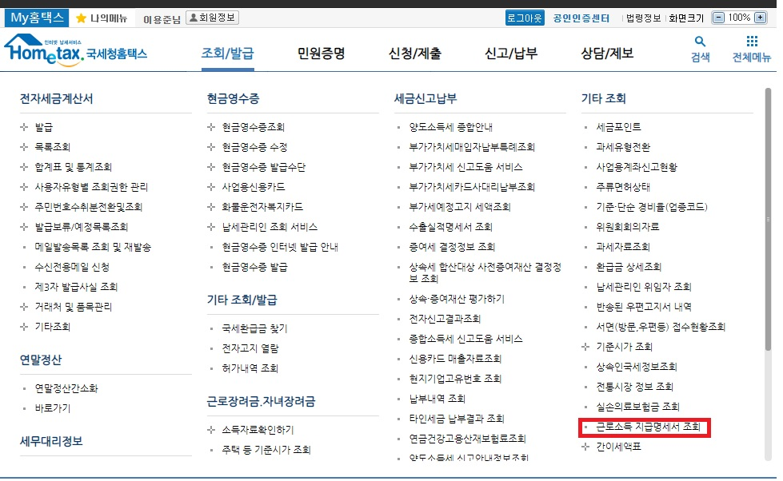

| 2019.03.17 | 5.원천징수영수증, 6.건강보험미납료 추가**
| 2019.03.15 | 준비 목록  
  
# 3월 19일 고용노동청 준비물

> 모든 준비물을 챙길 수는 없지만 중요도 높은 항목은 최대한 챙겨가야 돼    
 

## 1. 신분증 (중요도 100%)
**주민등록증**이나 **운전면허증**
   
## 2. 급여입금통장내역 (중요도 100%)
다들 [국민은행](https://www.kbstar.com/) 이나 [하나은행](https://www.kebhana.com/index.html) 이겠지?   
일을 시작한 날부터 오늘까지 모든 **입급내역** 조회해서 저장 (출금내역은 체크해제)    
은행홈페이지에서 최대 1년단위 조회되니까 파일이 2개이상 나올거야    

**pdf로 저장해놓고 인쇄소나 문방구가서 프린트 하려면?**  
 [Excel to PDF](https://smallpdf.com/kr/excel-to-pdf)에서 변환
  
   
## 3. 근로계약서 (중요도 90%)
**연봉협상때 쓰고 보관중인 것** 
없으면 서진씨한테 달라고 해야해  
만약 처음부터 근로계약서를 쓰지않았거나 서진씨가 안주면  
근로계약서 달라고 요구한 **전화내용**이나 **카톡내용** 가져가면 돼   
   
## 4. 차용증 (중요도 50%)
회사에서 밀린급여를 언제까지 주겠다는 내용의 문서인데  
아마 아무도 없을거야... 있으면 좋아    
   
## 5. 원천징수영수증 (중요도 ?)
[국세청홈텍스](https://www.hometax.go.kr/websquare/websquare.html?w2xPath=/ui/pp/index.xml) 접속
아래 사진에 버튼 클릭
  
사업자번호 클릭
   
**pdf로 저장해놓고 인쇄소나 문방구가서 프린트 하려면?**
  
   
   
## 6. 국민건강보혐료 미납내역 (중요도 ?)
[국민건강보험 징수포털](https://si4n.nhis.or.kr/jpza/JpZaa00102.do) 접속
아래 사진에 버튼 클릭
  
xls로 저장  

**pdf로 저장해놓고 인쇄소나 문방구가서 프린트 하려면?**
[Excel to PDF](https://smallpdf.com/kr/excel-to-pdf)에서 변환  
   
## 6. 출퇴근 이력 (중요도 30%)    
실제 회사에 가서 일을했다는 증거로 교통카드 내역이나 출퇴근체크 지문기록이 필요한데   
개인지문기록은 없을거고 나는 걸어다녀서 교통카드내역도 없어   
일단 이건 패스할건데 만약 노동청에서 출퇴근 증거가 필요하다고하면 SVN로그 2년치 긁어다가 줄거야   
   
## 7. 관련 카톡내용 (중요도 20%) 
대표님이랑 주고받은 **임금관련 카톡내용**있으면 캡처해   
   
## 8. 동료진술 (중요도 10%)   
우리가 단체로 임금체불진정서 제출한거라서 저절로 인정 되겠네
   

<table cellpadding="0" cellspacing="0" width="462">
<tr>
  <td style="border:1px solid #cecece;">
  </td> 
</tr> 
</table>
